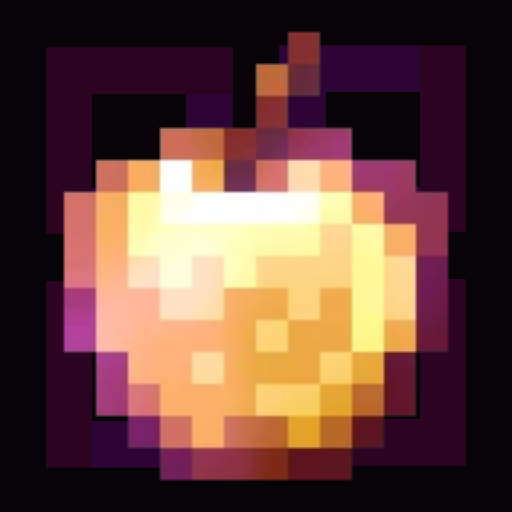

<div align="center">



<h2>JJ's Tools</h2>

<p><i>A Meteor Client add-on for 2b2t, built around quality of life, automation and hunting.</i></p>

</div>

---

## Overview

JJ's Tools is a [Meteor Client][meteor] add-on specifically built for 2b2t.

Credit to lambda and stardust for some modules

## Requirements

| Requirement | Description |
|---|---|
| Minecraft | 1.21.11 |
| Loader | [Fabric][fabric] |
| Required | [Meteor Client][meteor] |
| Optional | [XaeroPlus][xaeroplus], for the visited-chunk filter |
| Optional | [ViaFabricPlus][vfp], if you connect on an older protocol |


## Modules

| Module | Description |
|---|---|
| **Ad Blocker** | Hides advertisers in chat |
| **Advanced Autolog** | Logging tools for AFK travel over long distances |
| **Auto Door** | Opens doors ahead of you and shuts them behind you |
| **Auto Dye Shulkers** | Dyes shulker boxes and bundles in the crafting grid |
| **Auto Mason** | Works the stonecutter for you |
| **Auto Omen** | Drinks ominous bottles |
| **Auto Smith** | Upgrades gear and trims armour at smithing tables |
| **Auto Turtle Helmet** | Puts a turtle helmet on from your inventory |
| **Auto Wear Gold** | Puts a gold piece on while piglins are near and your own piece back after. Any of the four slots, leggings by default |
| **Banner Data** | Banner pattern information |
| **Battle Cry** | Sounds a goat horn when a player enters render distance |
| **Bed Marker** | Marks the bed you last set your spawn at, kept across sessions. Clears itself if the bed is broken in front of you |
| **Chat Notifications** | Plays a sound on whispers and mentions |
| **Chat Tweaks** | Cleans up chat: green text, the arrow prefix, and the junk other clients append |
| **Custom Trims** | Client side armour trims on your own armour, visible only to you |
| **Elytra Takeoff** | Jump, open the elytra and fire a rocket on one key, equipping an elytra first if you are not wearing one |
| **Enchant Fix** | Restores enchantment tooltip colours and ordering broken by ViaFabricPlus |
| **Encounters** | Records every player you meet, with first and last sighting, count and coordinates. Has its own tab in the Meteor GUI |
| **Farm Aura** | Plants a chosen crop on every empty bit of farmland in reach |
| **Fast Rename** | Renames items in bulk at an anvil |
| **Grinder** | Strips enchantments off selected items at the grindstone |
| **Incognito** | Covers your coordinates and minimap for screenshots and streams |
| **Item Frame Block** | Stops you rotating or interacting with item frames by accident |
| **Light Levels** | Improved from meteor's. Where mobs can spawn, as clean coloured squares, with a spawn area filter per dimension |
| **Portal Print Detector** | Finds the footprint a removed nether portal leaves behind: a four long recessed slot, or a patch of bare netherrack sitting in nylium |
| **Portal Scraps** | Finds leftover obsidian in the Nether. Skips ruined portals by the crying obsidian in them, and optionally skips highways and ring roads, which are paved in the stuff |
| **Rare Item Highlighter** | Highlights rare, unique and anomalous items in container slots |
| **Rubberband Notifier** | Reports lagbacks, with how many ticks you lost and how far you were moved |
| **Tab Optimizer** | Makes the tab list cheap to draw on servers with huge player counts |
| **Team Trees** | Plants saplings, either replanting a fixed plot you give coordinates for or scattering them across the ground around you. Presets cover every species, 1x1 and 2x2 |
| **Tiller** | Tills nearby dirt and grass, swapping a hoe in silently and stopping before it breaks |
| **Via Texture Fix** | Repairs the names and models of items ViaBackwards had to translate down to an older protocol |
| **XCarry** | Keeps the crafting grid as four extra inventory slots |


## Extra tabs

Two tabs are added to the Meteor GUI.

**Encounters** lists every player you have met, with buttons to add or remove them as a Meteor
friend. It only records while the Encounters module is on.

**Icons** sets the category icon for every module category, including categories belonging to other
add-ons, with an optional enchantment glint.

## Where your data is

Anything meant to stay after an update is stored outside Meteor's config, in `.minecraft/jjs-tools/`:

```text
.minecraft/jjs-tools/
├── accounts/
│   └── <your-uuid>/
│       ├── encounters.json    Players you have met
│       └── bed-marker.json    Your last bed respawn point
└── category-icons.json        Custom category icons
```

Encounters and your bed are kept per account, so two accounts on one install do not overwrite
each other. Category icons are shared, since they are a look rather than account data.

Updating Meteor, updating this add-on, or wiping a Meteor profile does not change these.

## Building

Requires JDK 21. The Gradle wrapper is included.

```bash
cd jjs-tools
./gradlew build
```

On Windows, `gradlew.bat build`.

The finished jar lands in `build/libs/`. Take the one without a `-sources` or `-dev` suffix.

Versions in `gradle.properties` follow Meteor's own 1.21.11 branch. Keep them matched to whichever
Meteor build you are running.

## License

GPL-3.0. See [LICENSE](LICENSE).

Parts are adapted from other GPL-3.0 projects, with attribution in the source files that use them.

[meteor]: https://meteorclient.com
[fabric]: https://fabricmc.net
[xaeroplus]: https://github.com/rfresh2/XaeroPlus
[vfp]: https://github.com/ViaVersion/ViaFabricPlus
